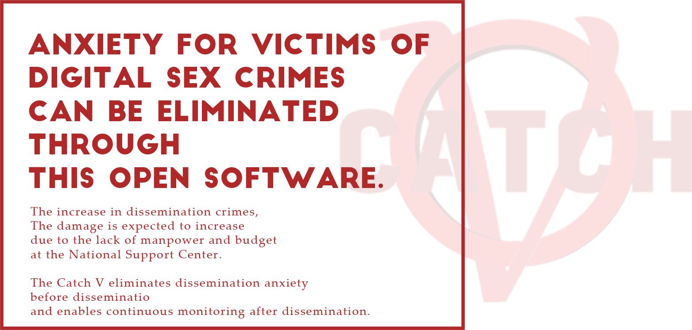
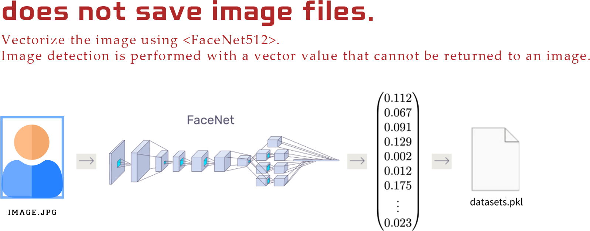
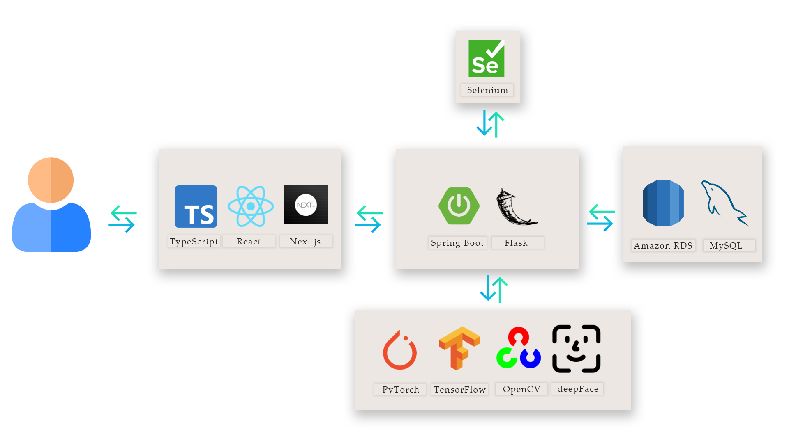
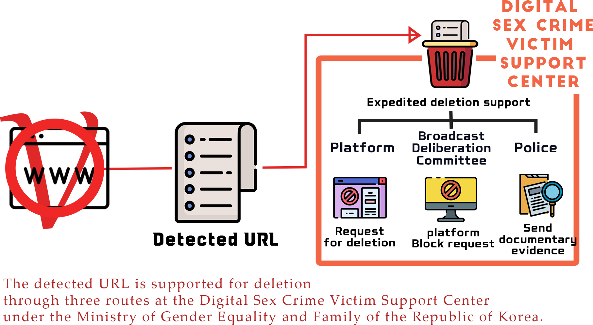

# readme.md

# 🕵️‍♀️ Catch V Project

## Abstract





---

## Goal

 It is a **spreading crime(with digital sex crime)** that people are **afraid to tell someone** or even to **ask for hel**p, so it is necessary to give the victim the strength to take action on their own**.**

**So we came up with this project to help the victims.**

---

## Demo Video

[https://youtu.be/PJ-SbIftBx8](https://youtu.be/PJ-SbIftBx8)

## Demo Website

- Please click this [**Link**](http://catchv-cf.duckdns.org:128)

---

## Tech Stack



---

## System Configuration



---

## How to Build

1. **Execution**
    1. **Front-End** : [https://github.com/gangfunction/catchvfrontnext.git](https://github.com/gangfunction/catchvfrontnext.git)
        - git clone or download zip file
            - git clone
                
                ```bash
                > git clone [https://github.com/gangfunction/catchvfrontnext.git](https://github.com/gangfunction/catchvfrontnext.git)
                > cd catchvfrontnext
                ```
                
        - Enter the command below
            
            ```bash
            > npm install yarn
            # If you get error
            > npm install yarn --global
            > yarn install
            > npm run bild
            > next start
            ```
            
    2. **Back-End** : [https://github.com/gangfunction/catchvbackend.git](https://github.com/gangfunction/catchvbackend.git)
        - git clone or download zip file
            - git clone
                
                ```bash
                > git clone https://github.com/gangfunction/catchvbackend.git
                ```
                
        - Change Directory for Execute Back-End Java file
            
            ```bash
            > cd catchvbackend/src/main/java
            ```
            
        - Execute java file
            
            ```bash
            > javac com/catchvbackend/CatchvbackendApplication.java
            > java com/catchvbackend/CatchvbackendApplication
            ```
            
        - There is no need to open a separate page
    3. **Flask**
        1. git clone or download zip file
            - git clone
                
                ```bash
                > git clone https://github.com/tmdqja75/CleanData.git
                ```
                
        2. Change Directory
            
            ```bash
            > cd CleanData
            ```
            
        3. Import File
            - zip File [Download](https://drive.google.com/file/d/1xtowuN7dZRAzPMpLzpb2lmwInq6zkrBD/view?usp=sharing)
            - Place testURL_youtube.csv file in data folder
            - Place dataset.pkl and pro_dataset.pkl in data folder
        4. Run
            - Enter the command below
            
            ```bash
            > pip install -r requirements.txt
            ```
            
            - Change working directory to run app.py
                - Enter the command below
                
                ```bash
                > cd ./CleanData/src
                > python app.py
                ```
                
            - [http://localhost:3001](http://localhost:3000/) access the link

---

## **How to contribute to our project**

### Code

- Find issues to solve, such as bugs, glitches, etc.
- Develop additional new features or feature improvement by **Pull Request**
- Code reviews submitted by other developers
- Tooling and testing improvements
- Create and improve tutorials on how to use the project
- Automate project setup

### Discussion

- Answer project-related questions on Stack Overflow or Reddit
- Answer people's questions in open issues
- Help manage discussion boards or chat channels

### Documentation

- Create and improve projects
- A selection of example folders that demonstrate how to use the project
- Start publishing a newsletter for the project or manage the highlights of the mailing list
- Create and improve project tutorials
- Contribute to project documentation translations

### Design

- Reorganize the layout to increase the usability of the project
- Reorganize and improve the project's navigation or menu through user research
- Create a style guide to ensure that the project has a consistent visual design

---

## License

- [MIT License](https://github.com/Catch-V/demo-repository/blob/main/LICENSE)

---

## Catch V Team

|Name|Contact|Position|Part|
|:—-|:—-|:—-|:—-:|:—-|
|Rok|max_sungrok@naver.com|PL|CI/CD|
|Jihun|chlwlgnd620@naver.com|AA|DeepLearning, Back|
|Ha|tmdqja75@gmail.com|DA|DeepLearning|
|gangfunction|gangfunction@gmail.com|Developer|Front, Back|
|Xilver|xilver0203@gmail.com|BA|Documentation|

---
